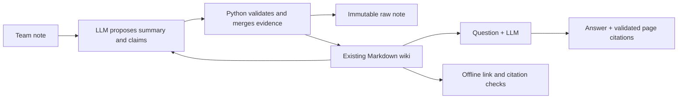

# LLM Team Wiki

[](https://github.com/WajeehGillani/llm-team-wiki/actions/workflows/tests.yml)

**Turn team notes into a small, linked Markdown wiki. Ask questions with citations.**

Inspired by [Andrej Karpathy's LLM Wiki idea](https://gist.github.com/karpathy/442a6bf555914893e9891c11519de94f): compile knowledge when a source arrives, then answer from that persistent knowledge. Each new note can enrich existing topics. Competing claims keep their evidence.

Three commands. Four implementation modules. Python and Markdown.

## See it in one minute

Browse the [example wiki](examples/memory/wiki/index.md), its [conflicting launch dates](examples/memory/wiki/topics/project-orbit.md), or the [terminal walkthrough](examples/WALKTHROUGH.md). No API key needed to read them.

The fictional team first records an October 12 launch, then receives an October 19 update. The wiki retains both claims, links to both sources, and marks the launch date unresolved.

Illustrative answer to **“When does Project Orbit launch?”**:

> The launch date is unresolved: the kickoff says October 12, 2026; Sam's update says October 19, 2026. Maya has not confirmed which is correct.
>
> Source: [Project Orbit](examples/memory/wiki/topics/project-orbit.md)

The checked-in wiki was built through the compiler using hand-authored, mocked model responses. It demonstrates the file format and behavior, not a recorded live model run. Live wording and topic choices vary.

## Try it in five minutes

Requires Python 3.12+ and Git. Tested on macOS and Linux.

```sh
git clone https://github.com/WajeehGillani/llm-team-wiki.git
cd llm-team-wiki
python3.12 -m venv .venv
source .venv/bin/activate
python -m pip install -e .

# Offline: check the included example, with no API key.
llm-wiki --root examples/memory lint

# Live ingestion and questions require an OpenAI API key and incur API usage.
export OPENAI_API_KEY="your-key-here"
export OPENAI_MODEL="gpt-4.1-mini"  # optional; this is the default

llm-wiki ingest examples/notes/01-project.md
llm-wiki ingest examples/notes/02-decision.md
llm-wiki ingest examples/notes/03-conflicting-update.md
llm-wiki ask "When does Project Orbit launch?"
llm-wiki ask "What is the team's budget?"
llm-wiki lint
```

The CLI creates `./memory/` for your data; Git ignores it. Use `llm-wiki --root /path/to/memory ...` for a different workspace. Environment variables are read from your shell; `.env` is not loaded automatically. `python -m llm_wiki` also works.

## How it works



```text
memory/
  raw/source-<content-hash>.md     # original bytes, never overwritten
  wiki/index.md                  # source and topic navigation
  wiki/sources/source-<hash>.md   # summaries with original source links
  wiki/topics/<topic>.md          # claims, evidence, conflicts, related topics
```

The LLM proposes structured topic claims. Python owns filenames, citations, merging, conflict notices, and writes. Source IDs come from content hashes, so exact repeat ingestion is a no-op. Each claim links to the note that introduced it; claims with the same topic/key and different values are retained as unresolved.

Ingestion validates the complete proposal before saving data and prepares the wiki in a staging directory. A caught publication failure restores the previous wiki; a saved raw note can be reused on retry. Questions read only compiled pages and cannot change memory. Missing information gets an explicit “not in the wiki” response.

| Module | Responsibility |
| --- | --- |
| [`cli.py`](llm_wiki/cli.py) | `ingest`, `ask`, `lint` |
| [`llm.py`](llm_wiki/llm.py) | Structured models and OpenAI calls |
| [`wiki.py`](llm_wiki/wiki.py) | Evidence merging, rendering, publication, answers |
| [`validation.py`](llm_wiki/validation.py) | Safe paths, bounded reads, offline checks |

## Tests

```sh
python -m unittest discover -s tests -v
```

Tests mock the model and need no API key. They cover updates, conflicts, citations, source preservation, repeat ingestion, malformed output, unsafe paths, missing evidence, and publication failure recovery. GitHub Actions runs the same suite and checks the example wiki.

## Deliberate limits

- This is a small, single-user CLI demo. Run one command at a time. No web app, accounts, connectors, database, or vector search.
- UTF-8 `.txt`/`.md` notes only: up to 32 KiB per note and 96 KiB for the entire compiled wiki. Each model call reads that small wiki in full.
- Citations validate provenance paths, not factual truth. Extraction, topic matching, and answer grounding can still be wrong; inspect the source evidence.
- Conflict detection compares values under the same topic/key. It does not infer semantic equivalence, changing facts over time, or automatically resolve disagreements. Answers append all recorded topic conflicts, even when some are unrelated.
- Generated pages are managed output. Unsupported manual topic edits block ingestion. Edit your source notes and ingest new versions instead.
- Staged writes handle ordinary exceptions, not power loss or concurrent processes. Back up valuable data. Runtime commands do not auto-commit or sync to Git.
- Ingestion sends the note and existing wiki to OpenAI; questions send the compiled wiki. No local model or offline question-answering is included.

## Credit and license

Concept inspired by [Karpathy's LLM Wiki](https://gist.github.com/karpathy/442a6bf555914893e9891c11519de94f). This repository is an independent, deliberately small implementation. All included team notes and names are fictional. [MIT license](LICENSE).
